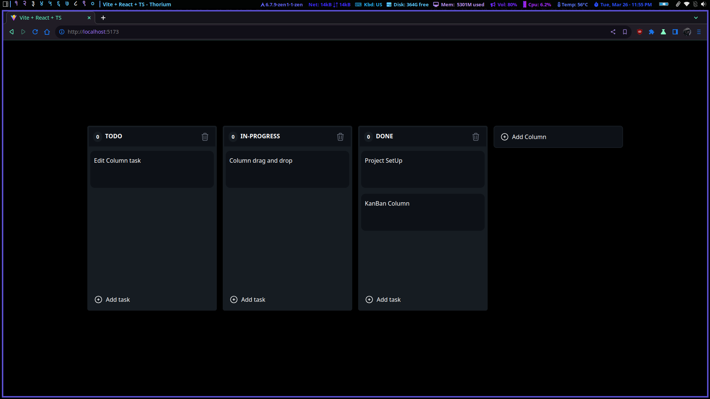

# KANBAN BOARD PROJECT
The Kanban Board project is a modern web application developed using React.js and Tailwind CSS, aimed at providing an intuitive and efficient platform for task management and project organization. With its user-friendly interface and responsive design, the Kanban Board allows users to create, organize, and track tasks across customizable boards, columns, and cards. Leveraging the power of React.js for dynamic rendering and Tailwind CSS for streamlined styling, this project offers a seamless user experience for individuals and teams looking to manage their workflows effectively.

## HOW TO RUN
```bash
$ npm run dev
```

## Images


